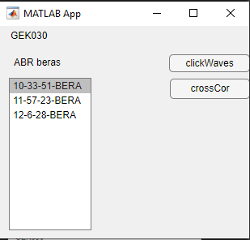
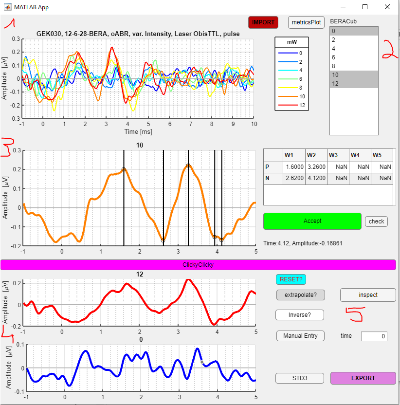
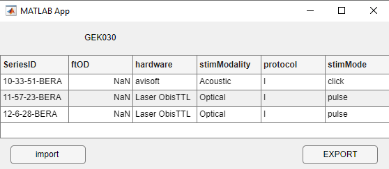

This file explains how to use the Feather Associated GUIs

# exploreBerabr
This GUI allows for exploration of all available ABR recordings.
 

On the top left if gives the **ExpID**, on the bottom left all the available berabr objects are listed with their **SeriesID**. In this box a specific ABR recordings can be selected and then with the buttons on the right we can choose what we want to do.
Pressing **clickWaves** opens the berabrWaveGUI2.mlapp to select the peaks of the ABR waves. 
Pressing **crossCor** plots a figure with automatic detected waves and computed cross correlation between the points (ask AV for more info).

# berabrWaveGUI2
This GUI allows us to identify the peaks of the recorded ABR waves.
 
In the top left area **(1)** we have the visualization of all available waves with the ExpID, ABR SeriesID, if it is acoustic (aABR) or an optical (oABR) recording and some more stimulus information in the title. The legend has the applied intensity values, but note that for laser stiulation these are usually not yet calibrated mW values but percent values. 

On the top right site (2) there is a box to shoose single traces. Left click on the one you want to work on (here the one with 10 mW intensity) and it gets displayed in the middle row (3). If you want to also see other traces for comparison at the bottom (4) click on them while holding the ctr. key. 
Within the displayed trace you can choose peaks by clicking on the pink **ClickyClicky** bar close to the peak time. t will find the local min or max timing. You can save the value in the array on the right in the correct field. If you do not like a selected minimum just click on a new timepoint and overwrite the table entry. If you want to add a manual entry, full in the time in (5) and press the **Manual Entry** buttom to get this value before pressing the field in the wave timepoint array in (3).
The **STD3** buttom on the bottom draws a line at 3* the std. of the background activity before trigger that can be used to decide if a peak is still a peak.  The inspect buttom in (5) opens a window with a similar effect but currently this is not fully functional. 
You need to press the green **Accept**-button to save the selected wave timepoints before moving to the next intensity level. Repeat this process for all waves in which you see detectable peaks. Then press **EXPORT** on the bottom right to save your results. If you already have results from a previous work session, press the **IMPORT** at the top to load your wave values. 

The **metricsPlot** button on the top right allows for a quick overview how amplitude and temporal delays change across the applied stimuli.
The **inverse?** Buttom in (5) inverts all traces in case the recording electrodes were placed in switched positions during the recording. 
The **check** button in 3 gives out warning in the Matlab Console based on your annotations (eg. when you have annotated peaks less than 3* the std. of the trace).
The **extrapolate** buttom does not work at the moment.

# userberabrOD
This GUI allows for the addition of user input that can not be automatically read in from the bera raw-data files, such as applied mechanical optical density filters.
 

 The first collumn shows the berabr SeriesID. The next allows for the input of optical density filters (in the case of e.g. OBIS 594 nm lasers) or also applied currents if this is a values that is changed in the bera ini file. These values are needed to find the correct calibration files so they should reflect what gets saved in the calibration filename. The stimModality differentiates between Acoustic and optical stimuli, the protocol shows what has been changed (stimulus intensity or rate or pulse duration...). All values except for the OD filter are filled automatically based on the information in the raw-data files. the **EXPORT** button saves the inputs, the **import** button loades a previously saved user data table. The table is saved as *ODui_ExpID.mat* in the processed data folder.